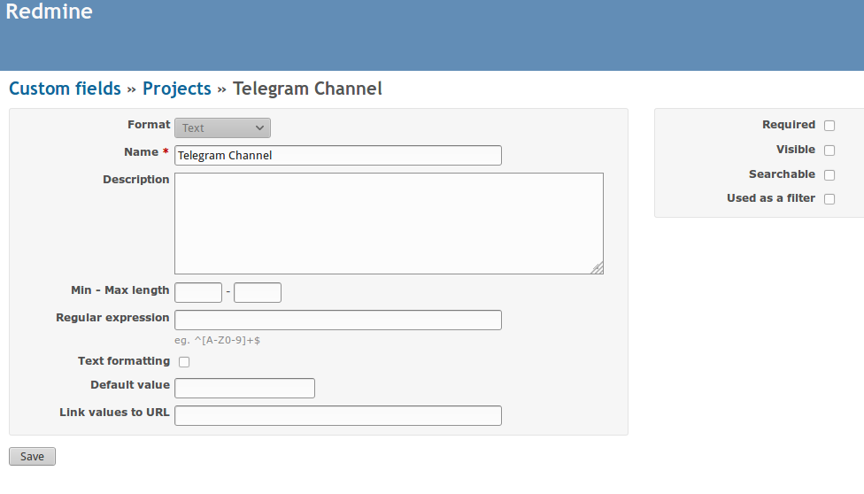
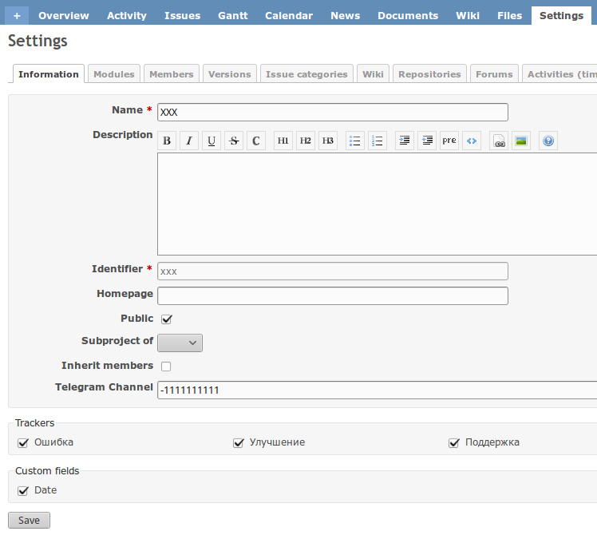
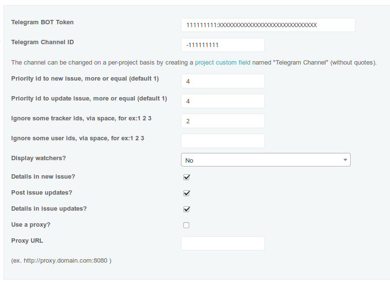
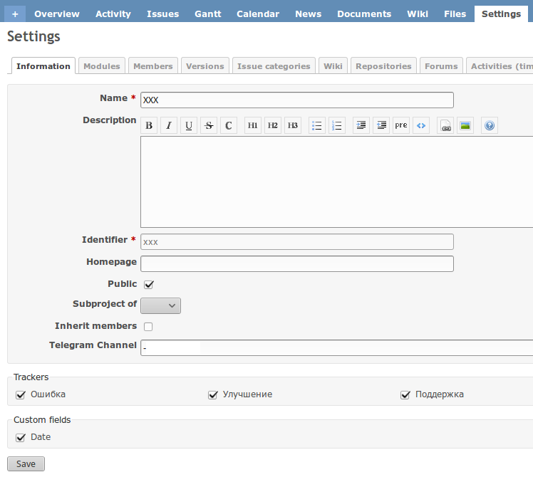

# Telegram chat plugin for Redmine

This plugin posts updates to issues in your Redmine installation to a Telegram
channel. Improvements are welcome! Just send a pull request.

## Installation

From your Redmine plugins directory, clone this repository as `redmine_telegram` (note
the underscore!):

    git clone https://github.com/ANemcov/redmine_telegram.git redmine_telegram

You will also need the `httpclient` dependency, which can be installed by running

    bundle install

from the plugin directory.

Start migration command

	bundle exec rake redmine:plugins:migrate RAILS_ENV=production

Restart Redmine, and you should see the plugin show up in the Plugins page.
Under the configuration options, set the "Telegram Bot Token" and default "Telegram Channel ID". For details see [Telegram BOT API](https://core.telegram.org/bots/API)

## Using

### Create project custom field

Create project custom field named "Telegram Channel" for ex: http://example.com/custom_fields/new?utf8=%E2%9C%93&type=ProjectCustomField (without quotes).

### For individual project or projects

Set channel into project settings

### Global for all projects

For all projects - http://example.com/settings/plugin/redmine_telegram

### Exclude project

To disable project from messaging use dash symbol, without quotes '-'

## Update plugin

Go to plugin girectory and pull last version
	
	git pull origin master

Then start migration database to new version

	bundle exec rake redmine:plugins:migrate RAILS_ENV=production

Last step - restart your web-server to apply changes.

Now you can use last version.

## Uninstall

From Redmine plugin directory run command

	bundle exec rake redmine:plugins:migrate NAME=redmine_telegram_global VERSION=0 RAILS_ENV=production

After that restart Redmine.

For more information, see http://www.redmine.org/projects/redmine/wiki/Plugins.

